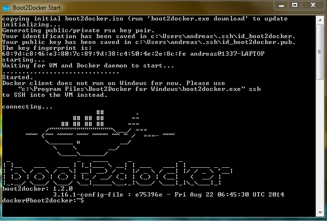

Docker
======

.. image:: _static/homepage-docker-logo.png
    :width: 40%

Installation von Docker auf Arch Linux
~~~~~~~~~~~~~~~~~~~~~~~~~~~~~~~~~~~~~~

.. code:: bash

    # Paketquellen updaten
    yaourt -Syy

    # Installieren
    yaourt -S docker

    # Überprüfen ob installation funktionier hat
    docker version

Installation von Docker auf Windows
~~~~~~~~~~~~~~~~~~~~~~~~~~~~~~~~~~~

Da Windows nicht die Kernel features von Linux zur Verfügung hat (welche Docker benötigt),
wird eine Mini-VM benötigt, auf der Linux mit Docker läuft.

Ein vorgefertigtes Image mit Installer kann `Hier <https://github.com/boot2docker/windows-installer/releases>`_ 
heruntergeladen werden.

Danach einfach auf die Datei doppelklicken und den Anweisungen folgen (evtl. VirtualBox/MSYS abwählen, falls
schon installiert.

Im Anschluss kann diese VM gestartet werden, Beispiel Ausgabe:

OracleXE als Docker Container
~~~~~~~~~~~~~~~~~~~~~~~~~~~~~

Installation
------------

.. code:: bash

    docker pull wnameless/oracle-xe-11g

Docker Container mit Port-Weiterleitung starten: 

.. code:: bash

    docker pull wnameless/oracle-xe-11gdocker run -d -p 49160:22 -p 49161:1521 wnameless/oracle-xe-11g

Datenbankverbindung mit folgenden Einstellungen:

* hostname: localhost
* port: 49161
* sid: xe
* username: system
* password: oracle

Password for SYS oracle

Login mit SSH 

.. code:: bash

    ssh root@localhost -p 49160

password: admin

[2]
