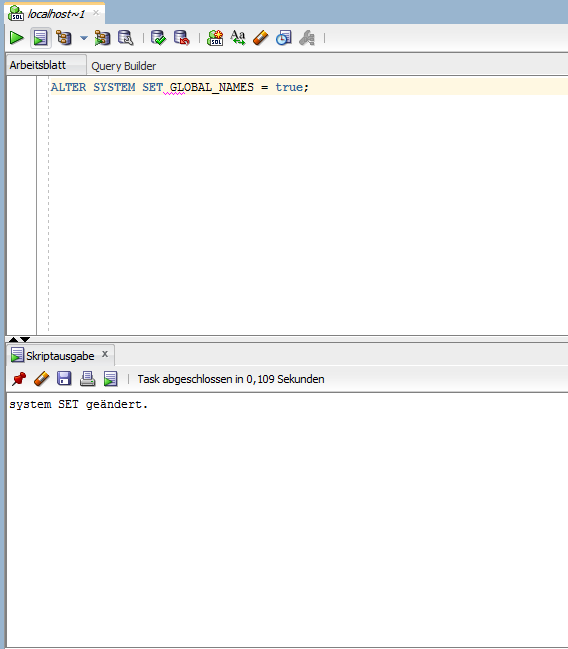
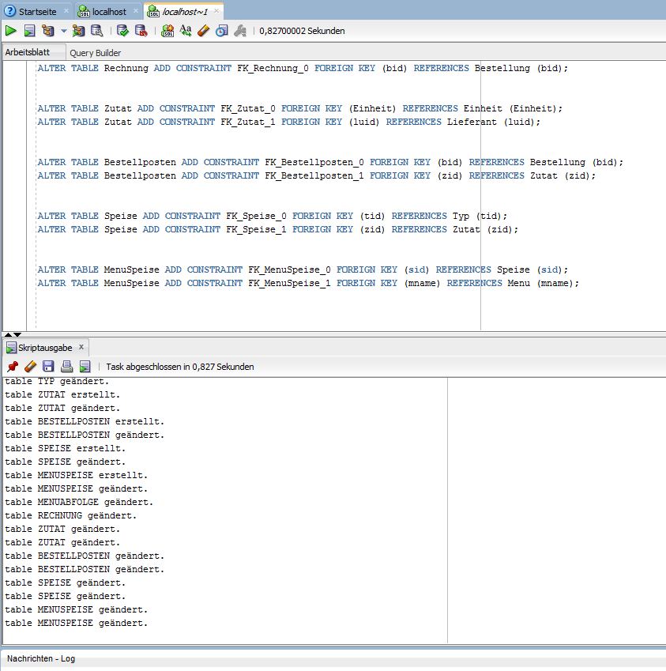
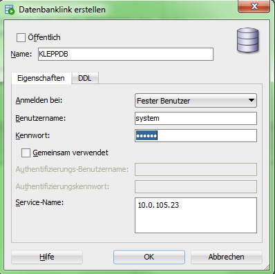

Konfiguration
=============

Fragmentierung
--------------

Wir haben uns für eine horizontale Fragmentierung entschieden.

Da wir verschiedene Standorte haben, muss die Daten Struktur immer gleich sein
und auch lokal verfügbar sein.
Des Weiteren ist diese einfacher konfigurierbar, da wir uns nicht speziell um 
die Verbundtreue kümmern müssen.

Durchführung
------------

Die Einrichtung des DB-links zwischen zwei Servern ist relativ einfach, es sind
nur wenige Schritte erforderlich.

Zu aller erst haben wir uns mit dem DB Server über den SQL Developer verbunden.

Dort muss der Parameter GLOBAL_NAMES auf true gesetzt werden, damit jede DB
Instanz einen eigenen, eindeutigen Namen erhält.

Im Anschluss wird das DDL Skript ausgeführt (NUR EINMAL!):

Danach kann auch schon der DB-link eingerichtet werden:

Dazu im SQL Developer die Verbindungsansicht aktivieren (standardmäßig aktiv)
und bei "Datenbanklinks" (in unserer Version, der 10. Eintrag von unten)
rechtsklicken und "Neuer Datenbank-Link" anklicken.

Nun noch die Daten des jeweilig anderen eintragen, und es können bereits SQL
Abfragen durchgeführt werden.

Verwendete Anleitungen
----------------------

http://docs.oracle.com/cd/B19306_01/server.102/b14200/statements_5005.htm
http://docs.oracle.com/cd/E11882_01/server.112/e10897/network.htm#ADMQS044