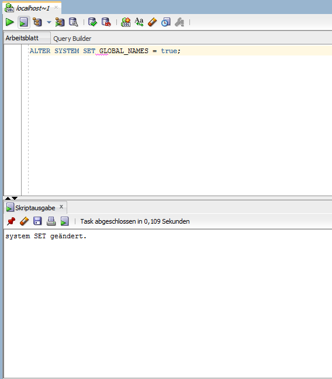
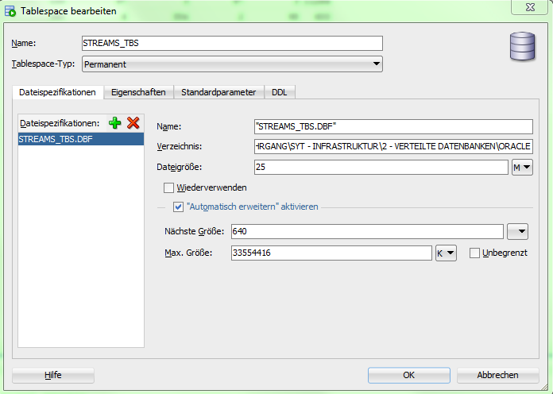
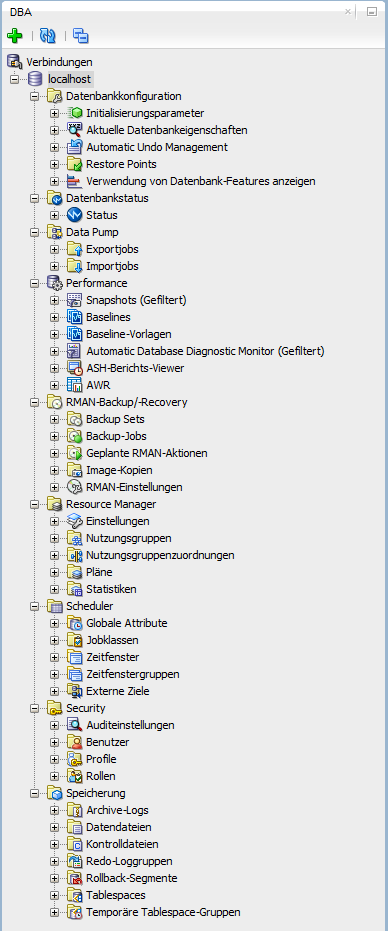
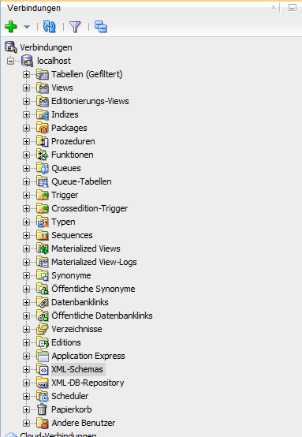

Konfiguration
=============

Fragmentierung
--------------

Wir haben uns für eine horizontale Fragmentierung entschieden.

Da wir verschiedene Standorte haben, muss die Daten Struktur immer gleich sein
und auch lokal verfügbar sein.
Des Weiteren ist diese einfacher konfigurierbar.

Durchführung
------------

Wir hatten keinen Erfolg mit der Konfiguration der Verteilten Datenbank, da
alle Anleitungen (siehe unten), welche sich auf dieses Thema beziehen, für den
Enterprise Manager (EM) ausgelegt sind.
Diser wird in der XE version nicht mitgeliefert und steht auch extra nur als
Cloud Variante zum Download bereit.

Wir hatten so weit es ging die Konfiguration mit dem SQL Developer vorzunehmen,
aber dieser bietet den Großteil der Features gar nicht an.

Zu aller erst haben wir uns mit dem DB Server über den SQL Developer verbunden.

Dort muss der Parameter GLOBAL_NAMES auf true gesetzt werden, damit jede DB
Instanz einen eigenen, eindeutigen Namen erhält.

Im nächsten Schritt muss ein Tablespace angelegt werden, dieser ist für den
Streams Administrator.

Im nächsten Schritt muss man einen Streams Administrator anlegen, jedoch bietet
der SQL Developer keinerlei Option um ihn anzulegen.

DBA Ansicht:

Normale Ansicht:

Verwendete Anleitungen
----------------------

http://docs.oracle.com/cd/E11882_01/server.112/e17516/tdpii_common_ii.htm#TDPII009
http://docs.oracle.com/cd/E11882_01/server.112/e17516/tdpii_distdbs.htm#TDPII020
http://docs.oracle.com/cd/E11882_01/server.112/e10897/network.htm#ADMQS044
http://docs.oracle.com/cd/E11882_01/server.112/e17516/tdpii_repcont.htm#TDPII181